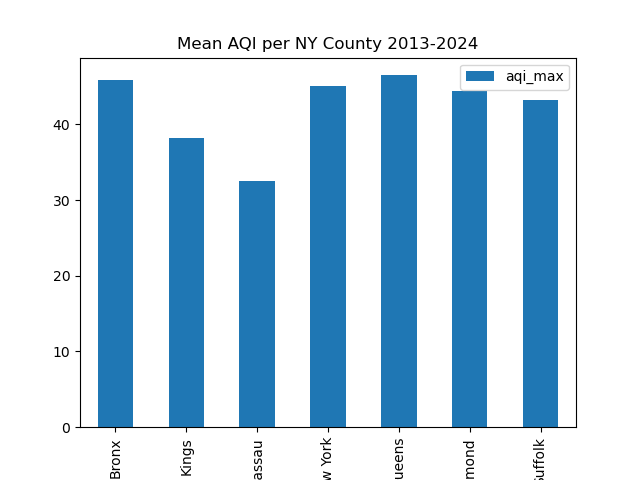

# Air Pollution Trends in New York City and Long Island
Project2-Group4

## Group Members
Girish Hosalli
Christine Chung
Shephali Dubey
Xiwu Dai
Chearine Pringle

## Project Overview
The aim of our project is to discover trends in air pollution in New York City (NYC) and Long Island (LI) by analyzing the Air Quality Index (AQI) data from the past two years. Additionally, we will predict the AQI for the upcoming year using machine learning models. This analysis will provide valuable insights for individuals, especially those in sensitive groups (such as children, elderly people, and those with respiratory conditions), helping them to understand when it is safe to go outside and when they should take precautions.

## Detailed Project Description
### Background
Air pollution is a significant environmental issue that affects millions of people worldwide. In urban areas like New York City (NYC), the air quality can fluctuate dramatically due to various factors such as traffic emissions, industrial activities, and weather conditions. Poor air quality has been linked to a range of health problems, including respiratory diseases, cardiovascular issues, and adverse effects on children and the elderly.

New York City, one of the most densely populated cities in the United States, faces unique challenges related to air pollution. The city's extensive network of roads, high vehicle density, numerous industrial operations, and seasonal weather variations contribute to the complexity of its air quality dynamics. Monitoring and predicting the Air Quality Index (AQI) is crucial for public health and safety, particularly for sensitive groups such as children, the elderly, and individuals with pre-existing health conditions.

*relevant video:* 

### Motivation
Understanding the trends and patterns in air pollution can help policymakers and health officials implement better strategies to improve air quality. By predicting future AQI levels, we can provide timely warnings to vulnerable populations, helping them make informed decisions about outdoor activities. This project aims to contribute to public health awareness and support efforts to mitigate the adverse effects of air pollution.

## Data Sources
The AQI data for New York City has been sourced from the Environmental Protection Agency (EPA). 

## Methodology
We began by collecting AQI data from the EPA using their API. This data was then cleaned and preprocessed, followed by extensive Exploratory Data Analysis (EDA). For model development, we employed several supervised learning machine learning models, including Logistic Regression, K-Nearest Neighbors (KNN), Decision Tree, Random Forest Regressor, Linear Regression, and Prophet. These models were rigorously checked for data leakage and optimized through accuracy, precision, R-squared, mean squared error (MSE), and cross-validation checks. We decided to use the Random Forest and Prophet models to make predictions for the next year based on their performance.

## Visualizations

## Result Summary
Our analysis revealed important temporal and spatial trends in air quality. Over multiple years, we observed long-term trends and seasonal patterns, with higher AQI scores typically occurring in the summer months. Spatial variations were also evident, with different counties exhibiting varying levels of air quality due to factors such as population density, industrial activity, and local geography. Pollutant-specific observations highlighted that ozone levels were higher in the summer, while PM2.5 levels showed significant variability and were often the primary drivers of high AQI scores. Nitrogen Dioxide levels were generally higher in urban areas and during winter months.

The Random Forest Regressor model demonstrated high train accuracy at 98.9% and test accuracy at 92.6%, while the Prophet model showed that its predictive accuracy decreased over time, with RMSE between 9.48 to 12.95 points and mean absolute error (MAE) between 7.5 to 9.17 points.

## Future Work
Future enhancements could include connecting weather and mortality data to our analysis for a more comprehensive view of air quality impacts. Additionally, developing a frontend dashboard to pull data by zip code would make the information more accessible to the public. Learning and implementing ARIMA models could also improve our forecasting accuracy.

## Installation
### Requirements
To run this project, you will need Python 3.x and the following libraries: pandas, numpy, scikit-learn, prophet, and matplotlib.

### Instructions
1. Clone the repository:
git clone <repository_url>
2. Navigate to the project directory:
cd project_directory
3. Install the required libraries:
'pandas'
'matplotlib'
'seaborn'
'plotly'
'numpy'
'requests'
'json'
'os'
'time'
'dotenv'
'sklearn'
'datetime'
'plotly'
'prophet'
'mpl_toolkits'

## Usage
1. Clone the repository to the place you like.  
2. Navigate to the project directory:  
`cd AQI-Detectives`  
3. Run the Jupyter notebook to interact with the data and perform analyses:  
`jupyter notebook`  

## Presentation Link
https://gamma.app/docs/Air-Quality-A-Critical-Global-Concern-zuamahmfgrbgjo2?mode=doc

## Contact
For any questions or issues, please open an issue on the GitHub repository or contact the project maintainers through GitHub.

## Reference
OpenAI. (2024). ChatGPT: Chatbot by OpenAI. Retrieved from https://www.openai.com
